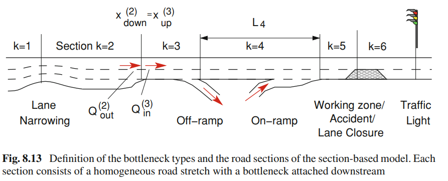

# Traffic Flow

This python project aims to build a high performance simulation of the traffic flow using Python. 

- [ ] Macroscopic Model
  - [ ] Continuity Equation
    - [ ] Homogeneous Road Section
    - [ ] Sections with On- and Off-Ramps
    - [ ] Changes in the Number of Lanes
  - [ ] Lighthill-Whitham-Richards (LWR) Model
- [ ] Microscopic Model
- [ ] Cellular Automaton (CA)
- [ ] Pedestrian Model

## Modeling Bottlenecks

- Classical Flow-Conserving Bottlenecks
- Lane-Drop Bottlenecks
- On-Ramps
- Off-Ramps
- Traffi Lights